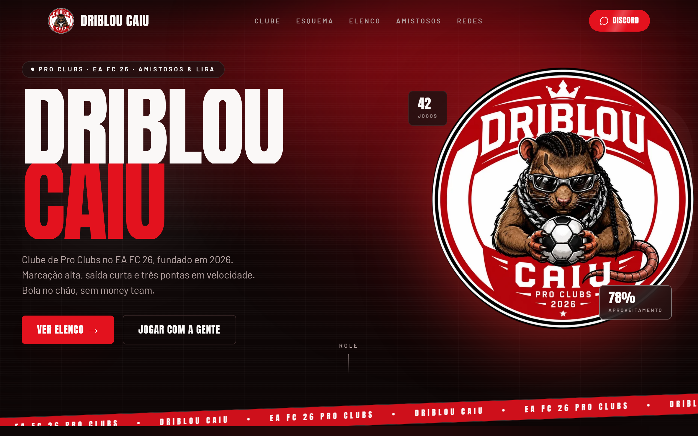

# Driblou Caiu FC

**Landing page de clube de Pro Clubs** · React · TanStack Start

[](https://dribloucaiu-landing.vercel.app)
[](https://react.dev)
[](LICENSE)

Site oficial do **Driblou Caiu**, clube de Pro Clubs no **EA FC 26**: elenco, esquema tático interativo, amistosos e redes sociais do time, com identidade visual inspirada nos cards do próprio jogo.

🔗 **Site no ar:** [dribloucaiu-landing.vercel.app](https://dribloucaiu-landing.vercel.app)



## Sobre o projeto

Landing page em single-page, construída com React 19 + TanStack Start (SSR), com animações em cada seção via Framer Motion. O visual segue a estética de cards estilo Ultimate Team, tons de vermelho e preto do escudo do clube, cards com efeito de rating/raridade e um campo tático arrastável.

## Seções

- **Início**, hero com escudo do clube, estatísticas rápidas e CTA
- **Sobre**, manifesto do clube, regras e lema
- **Esquema**, campo tático interativo: escolha entre 8 formações, arraste os jogadores pra reorganizar o time e veja vagas em aberto quando não há jogador pra posição
- **Elenco**, cards dos jogadores estilo Ultimate Team, com stats, raridade e foto de cada um
- **Amistosos**, último resultado, histórico de jogos e convite pra marcar partida
- **Redes**, links pro Instagram, TikTok e Discord do clube

## Stack

- **[TanStack Start](https://tanstack.com/start)**, React 19 + SSR
- **[TanStack Router](https://tanstack.com/router)**, roteamento
- **[Tailwind CSS 4](https://tailwindcss.com/)**, estilização utilitária
- **[Framer Motion](https://www.framer.com/motion/)**, animações e drag-and-drop do esquema tático
- **[Radix UI](https://www.radix-ui.com/)**, componentes acessíveis
- **[Recharts](https://recharts.org/)**, gráfico de radar nos cards dos jogadores
- **[Vite 8](https://vite.dev/)** + **[Nitro](https://nitro.build/)**, build e servidor
- **[Bun](https://bun.sh/)**, runtime e gerenciador de pacotes

## Como rodar

Requer [Bun](https://bun.sh) (ou Node.js + npm).

```bash
git clone https://github.com/joaobatis1a/dribloucaiu-landing.git
cd dribloucaiu-landing
bun install
bun run dev
```

Acesse `http://localhost:3000`.

### Outros comandos

```bash
bun run build     # build de produção
bun run preview   # pré-visualiza o build de produção localmente
bun run lint      # eslint
bun run format    # prettier
```

## Deploy

O projeto já está configurado pra rodar tanto na Vercel quanto no Cloudflare (via Nitro, que troca de preset automaticamente pela variável de ambiente `VERCEL`):

1. Conecte o repositório na plataforma escolhida
2. Build command: `bun run build`
3. Deploy automático a cada `git push` na branch `main`

## Estrutura

```
src/
├── components/
│   ├── Hero.tsx
│   ├── TeamStats.tsx
│   ├── About.tsx
│   ├── Formation.tsx       # esquema tático interativo
│   ├── Squad.tsx           # grade do elenco
│   ├── PlayerCard.tsx      # card individual do jogador
│   ├── Friendlies.tsx      # amistosos
│   ├── SocialLinks.tsx
│   ├── Navbar.tsx
│   ├── SiteFooter.tsx
│   └── ScrollToTop.tsx
├── data/
│   └── team.ts             # elenco, resultados e dados do clube
├── lib/
│   ├── formations.ts       # posições de cada esquema tático
│   └── match.ts            # raridade dos cards e helpers de partida
├── assets/players/          # fotos dos jogadores
└── routes/                  # rotas do TanStack Router
```

## Autor

**João Batista da Silva Neto**
Desenvolvedor Front-End

- GitHub: [@joaobatis1a](https://github.com/joaobatis1a)
- LinkedIn: [joao-batista-silva-neto](https://linkedin.com/in/joao-batista-silva-neto)
- E-mail: [profissionalba1is1a@gmail.com](mailto:profissionalba1is1a@gmail.com)

## Licença

Distribuído sob a licença MIT. Veja [`LICENSE`](LICENSE) para mais detalhes.
